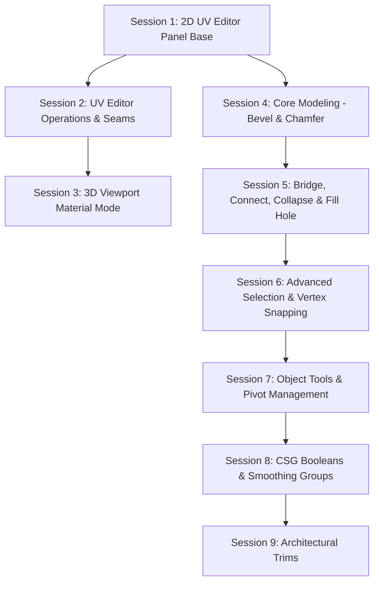

# PoiBuilder Feature Implementation Roadmap

Comprehensive architectural plan and session-by-session roadmap bridging the feature gaps between **Unity ProBuilder** (`SPECIFICATION.md`), **UniBuilder** (`unibuilder.dev`), and **PoiBuilder**.

---

## 1. Architectural Principles & Invariants

All future implementation sessions must uphold PoiBuilder's non-negotiable core invariants:

1. **Position-Privacy Invariant (`PBMeshOps`)**:
   - Every face owns its corner positions exclusively. Faces meeting at a 3D corner are connected by shared-vertex weld groups (`PBMeshData.shared_vertices`), never by shared position array indices.
   - Sharing positions across faces with differing surface normals corrupts flat normals (flat normal calculation writes per position index, where the last face wins).
   - New faces duplicate every corner; topology updates compact orphaned indices and rebuild welds via `PBMeshData.rebuild_welds()`.
2. **Winding Conventions**:
   - Internal data: CCW-from-outside (Unity convention). Normals point OUTWARD.
   - Godot compilation: `to_array_mesh()` reverses index order for Godot's CW front faces; attribute normals pass through unchanged (outward). Locked by `tests/test_pb_winding.gd`.
3. **Selection Single Source of Truth**:
   - In element modes, the engine's subgizmo selection is the authoritative element selection. `PBSelection` mirrors engine $\to$ plugin during redraw.
4. **Undo/Redo Rigor**:
   - Every user action is exactly one undo step via `EditorUndoRedoManager` with `custom_context` passed to `create_action`. Actions modifying scene nodes must register `add_do_reference`.
5. **Texture Splatting & Stamping Superiority**:
   - PoiBuilder's existing multi-layer texture splatting engine (`PBSplat`, 8 layers, continuous barycentric UV2 mapping, SDF antialiased contours, billboard decal stamping, and retro baked tile export) is far more capable than simple per-corner vertex coloring or 2-layer alpha blending. We do NOT replace or duplicate our splatting system. Simple vertex colors are reserved for face tinting and baked vertex lighting.

---

## 2. Feature Gap Inventory

### A. UV & Texture Editing (The Flagship Gap)
- **Dedicated 2D UV Editor Panel**:
  - Interactive 2D canvas with cursor-anchored zoom, pan (middle-click / space-drag), and frame (fit to $[0, 1]$ or selection).
  - Grid underlay with adaptive snap step, $[0, 1]$ unit square border, and origin markers.
  - Texture underlay: active material albedo texture displayed in $[0, 1]$ space (with optional repeat tiling).
  - UV Wireframe rendering for vertices, edges, and faces; unselected (subtle cyan/white), selected (bright yellow), hovered (cyan).
  - Selection modes: UV Vertex, UV Edge, UV Face, and UV Island (double-click connected shell); bidirectional sync with 3D scene selection.
  - 2D Transform Gizmos: Move, Rotate (15° detents), Scale (uniform & per-axis) with incremental grid snapping and vertex proximity snapping.
  - UV Mode Conversion: Convert to Manual (bakes explicit coords into `mesh_data.textures0`), Convert to Auto (restores planar projection).
  - Projection Tools: Planar Project (along average face normal), Box Project (per-face cardinal dominant axis), Fit UVs ($[0, 1]$ normalization).
  - Seam & Topology Tools: Sew/Weld UVs (stitch coincident 3D edges in UV space), Split UVs (tear UV seams).
  - Utilities: Flip U/V, Rotate 90° CW/CCW, Copy/Paste UV settings, Texel Density Normalization (match world-space texel density), and Export UV Template PNG.
- **In-Scene 3D Viewport Texture Tool ("Material Mode")**:
  - Interactive 3D planar gizmo directly on the face surface in the viewport (UniBuilder `6` key / ProBuilder `TextureTool`).
  - Directly slide (translate U/V), stretch (scale U/V), and turn (rotate) textures live on 3D geometry with 1:1 cursor lockstep.

### B. Core Modeling & Topology Operations
- **Bevel / Chamfer**:
  - Multi-segment edge and face beveling (1 to 8 segments) with circular arc curvature, smooth shading groups, corner vertex explosion, and hole-filling caps.
  - Modal `Ctrl+B` mouse-drag interaction with mouse wheel segment adjustment and live parameter panel editing.
- **Bridge**:
  - Connect two open boundary edges across a gap with planar untwisting (detects diagonal intersection to prevent bow-tie faces).
- **Connect**:
  - Connect Edges: insert edges connecting the midpoints of selected edges across adjacent faces.
  - Connect Vertices: split a face by inserting an edge between two non-adjacent vertices on that face.
- **Collapse**:
  - Collapse selected edges (endpoints to midpoint) and faces (corners to centroid).
- **Fill Hole**:
  - Automatically detect open boundary loops from selected edges or vertices and cap with a polygon face.

### C. Advanced Selection Suite
- **Grow / Shrink Selection**:
  - Expand/contract selection across vertices, edges, or faces with optional normal angle threshold (e.g. 15° to prevent growth over sharp corners).
- **Select Coplanar Faces**:
  - Expand selection across adjacent faces lying on the same geometric plane.
- **Select Similar**:
  - Select all faces sharing Material, Smoothing Group, or Color with active selection.
- **Select Boundary / Holes**:
  - Select all perimeter boundary edges across the mesh.
- **Select All (`Ctrl+A`) & Invert (`Ctrl+I`)**:
  - Element-aware selection inversion and select-all.
- **Face Loop & Face Ring**:
  - Directional quad strip selection via double-click on face edges.
- **Selection Mode Conversion**:
  - Preserves geometric intent across mode switches (Face $\to$ Edge selects perimeter; Edge $\to$ Vertex selects vertices; Vertex $\to$ Face selects fully covered faces).

### D. Interactive Snapping & Precision
- **Vertex Snapping (Hold `V`)**:
  - Holding `V` while dragging gizmo snaps the grabbed vertex to the nearest vertex on *any* mesh in the scene (target vertex highlighted with amber ring and crosshair).
- **Proportional Editing (Soft Selection)**:
  - Move/rotate/scale with configurable falloff curves (Smooth, Sphere, Linear, Sharp, Constant) and interactive mouse wheel radius adjustment.

### E. Object-Level Operations
- **Merge Objects**:
  - Combine multiple selected `PBMesh` nodes into a single `PBMesh`, baking node transforms, mapping materials into submesh slots, and cleaning up donor nodes with full undo.
- **Mirror Object**:
  - Reflect geometry across local X, Y, or Z plane with normal reversal and seam welding.
- **Convert to PoiBuilder (Probuilderize)**:
  - Convert standard Godot `MeshInstance3D` or CSG nodes into an editable `PBMesh` (vertex welding + coplanar triangle-to-quad/n-gon reconstruction).
- **Pivot Tools**:
  - Center Pivot, Set Pivot to Selection, Freeze Transform (bake node transform into vertices and reset node transform to identity).

### F. CSG Booleans
- **Boolean Union, Subtract, Intersect**:
  - Solid constructive solid geometry between two `PBMesh` nodes, producing clean editable n-gon geometry with non-manifold error reporting and edge highlighting.

### G. Smoothing Groups & Surface Normals
- **Smoothing Group Editor**:
  - Assign integer smoothing groups (0 = hard, 1..30 = smooth) per face.
  - Auto-smooth by dihedral angle threshold (e.g. 30° / 45°).
  - Viewport normal line preview overlay.

### H. Architectural Primitives (UniBuilder Pattern)
- **Trim & Trim Walls**:
  - Skirting, Cornice, and Dado rail profiles (Flat, Chamfer, Round, Cove, Ogee, Stepped) with automated wall-loop sweeping, mitred corners, and doorway breaks.

---

## 3. Implementation Roadmap (Focused Sessions)

---

### Session 1: 2D UV Editor Panel — Canvas, Navigation, Rendering & Selection Sync
- **Goal**: Build the bottom-panel 2D UV Editor with navigation, background texture underlay, wireframe rendering, and bidirectional selection synchronization.
- **Files**:
  - `editor/uv/pb_uv_editor_panel.gd`: Main bottom panel container (`add_control_to_bottom_panel(panel, "UV Editor")`) with toolbar header, zoom controls, and pop-out window capability.
  - `editor/uv/pb_uv_canvas.gd`: Custom 2D `Control` managing cursor-anchored zoom, middle-mouse / space-drag panning, coordinate space conversion ($UV \leftrightarrow \text{Screen}$), and `_draw()` rendering.
- **Features**:
  - Dark slate grid background, $[0, 1]$ unit square boundary with origin labels.
  - Active face material texture drawn in $[0, 1]$ bounds with repeat tiling toggle.
  - Wireframe rendering for UV vertices, edges, and faces from `mesh_data.textures0`.
  - UV Vertex, UV Edge, and UV Face selection modes with point-picking, marquee drag, and bidirectional sync with 3D scene selection.
- **Verification**: Headless GUT tests for coordinate transformations and selection mapping; GUI harness verifying panel display and texture drawing.

---

### Session 2: UV Editor Operations — 2D Transforms, Snapping, Seams & Projections (Complete ✓)
- **Goal**: Add interactive 2D manipulation gizmos and core UV actions inside the 2D UV Editor canvas.
- **Files**:
  - `editor/uv/pb_uv_gizmo.gd`: 2D transform handles (Move, Rotate, Scale) with grid snapping and proximity snapping.
  - `editor/uv/pb_uv_ops.gd`: Headless-testable UV operations.
- **Features**:
  - 2D Transform Interaction: Drag-to-move, rotate (15° detents), scale (uniform and per-axis with `Shift`).
  - Mode Conversion: Convert to Manual (bakes explicit coords into `mesh_data.textures0`), Convert to Auto (restores planar projection).
  - Projections: Planar Project (along average face normal), Box Project (per-face cardinal dominant axis), Fit UVs ($[0, 1]$ normalization).
  - Transformations: Flip U, Flip V, Rotate 90° CW/CCW.
  - Seam Tools: Sew UVs (stitch coincident 3D edges in UV space), Split UVs (tear UV seams), Select Island (double-click connected UV shell).
  - Utilities: Texel Density Normalize (match pixel-per-meter density across faces) and Export UV Template PNG.
- **Verification**: GUT test suite covering UV math, seam splitting/welding, and projection algorithms.

---

### Session 3: In-Scene 3D Viewport Texture Tool ("Material Mode") (Complete ✓)
- **Goal**: Implement UniBuilder's "Material Mode" (`6` key) and ProBuilder's `TextureTool` in PoiBuilder.
- **Files**:
  - `editor/pb_texture_tool.gd`: 3D viewport planar gizmo projected onto face surface.
  - `poibuilder_plugin.gd` / `pb_editor.gd`: Integration with mode switcher (`SelectMode.TEXTURE_MANIPULATION` / `6` key).
- **Features**:
  - 3D planar gizmo on active face: translation center square (slide texture along U/V), axis handles (stretch U/V), uniform scale handle, rotation ring (15° snap detents).
  - Dragging auto-projected faces seamlessly bakes them to manual UVs without visual jumps.
- **Verification**: Viewport interaction tests verifying texture sliding/rotating matches cursor movement 1:1.

---

### Session 4: Core Modeling — Bevel & Chamfer (Complete ✓)
- **Goal**: Implement multi-segment edge and face beveling with smooth shading.
- **Files**:
  - `mesh_ops/pb_mesh_ops.gd` (`bevel_edges`): Edge sliding, bridge face generation, corner vertex explosion, circular arc multi-segment rounding (1 to 8 segments), and corner hole caps.
  - `editor/pb_element_editor.gd`: Modal `Ctrl+B` mouse-drag interaction with mouse wheel segment adjustment.
- **Features**:
  - Chamfer (1 segment) to rounded fillets (2–8 segments).
  - Corner hole cap generation (triangles or tent fans).
  - Live parameter adjustment in overlay adjust panel.
- **Verification**: Geometric watertightness tests, normal orientation checks, and multi-segment profile assertions.

---

### Session 5: Topology Operations — Bridge, Connect, Collapse & Fill Hole (Complete ✓)
- **Goal**: Complete the core polygon modeling toolkit.
- **Files**:
  - `mesh_ops/pb_mesh_ops.gd`:
    - `bridge_edges`: Connects two boundary edges across a gap with planar untwisting logic.
    - `connect_edges`: Connects edge midpoints across adjacent faces (quad split & n-gon centroid split).
    - `connect_vertices`: Splits a face between two non-adjacent vertices.
    - `collapse_elements`: Merges selected edges or faces to their centroid.
    - `fill_hole`: Detects open boundary loops and caps them with a valid polygon face.
- **Features**:
  - Toolbar buttons and shortcuts (`Alt+B` for Bridge, `Alt+E` for Connect, etc.).
  - Position-privacy and weld group maintenance across all ops.
- **Verification**: Topology invariant verification (edge usage counts $\le 2$, watertightness, winding consistency).

---

### Session 6: Advanced Selection & Snapping Suite (Complete ✓)
- **Goal**: Implement comprehensive selection utilities, vertex snapping, and proportional editing.
- **Files**:
  - `editor/pb_selection_ops.gd`: Selection expansion and query algorithms.
  - `editor/pb_element_editor.gd`: Vertex snapping and proportional editing integration.
- **Features**:
  - Selection Actions: Grow/Shrink selection (`Alt+G` / `Alt+Shift+G` with angle limit), Select Coplanar, Select Similar (Material, Smoothing, Color), Select Boundary/Holes, Select All (`Ctrl+A`), Invert Selection (`Ctrl+I`), Face Loop/Ring.
  - Automatic selection conversion across mode switches.
  - Precision Snapping: Hold `V` vertex snapping (snaps dragged element pivot to nearest vertex across any scene mesh).
  - Proportional Editing (Soft Selection): Falloff curves (Smooth, Sphere, Linear, Sharp, Constant) with mouse wheel radius adjustment.
- **Verification**: Unit tests asserting selection set expansion/shrinkage on complex test meshes.

---

### Session 7: Object Tools — Merge, Mirror, Probuilderize & Pivots (Complete ✓)
- **Goal**: Implement whole-object manipulation actions.
- **Files**:
  - `editor/pb_object_ops.gd`: Whole-object algorithms.
  - `editor/pb_toolbar.gd`: Object tools menu integration.
- **Features**:
  - Merge Objects: Combines multiple `PBMesh` nodes into one, baking transforms, mapping materials to submeshes, with full undo.
  - Mirror Object: Reflects geometry across local Cartesian planes with normal reversal and seam welding.
  - Convert to PoiBuilder (Probuilderize): Converts standard Godot `MeshInstance3D` into an editable `PBMesh` (vertex welding + coplanar triangle-to-quad/n-gon reconstruction).
  - Pivot Tools: Center Pivot, Set Pivot to Selection, Freeze Transform.
- **Verification**: Multi-mesh combine tests, submesh slot validation, and undo/redo integrity.

---

### Session 8: CSG Booleans & Smoothing Groups (Complete ✓)
- **Goal**: Provide solid boolean modeling and normal smoothing groups.
- **Files**:
  - `mesh_ops/pb_csg.gd`: Boolean engine (Union, Subtract, Intersect) using Godot's Manifold CSG kernel with clean n-gon reconstruction.
  - `editor/pb_smooth_groups.gd`: Smoothing groups 1..30 per face, auto-smoothing angle threshold, and normal vector preview.
- **Features**:
  - Pre-flight watertightness check; highlights non-manifold boundary edges if invalid.
  - Material slot retention from both operands.
  - Dihedral angle auto-smoothing.
- **Verification**: Standard boolean test battery (box minus cylinder, sphere union box), watertightness assertions.

---

### Session 9: Architectural Trims (Trim & Trim Walls) (Complete ✓)
- **Goal**: Bring UniBuilder's room moulding and trim generation into PoiBuilder.
- **Files**:
  - `shapes/pb_shape_trim.gd`: Procedural moulding profiles (Skirting, Cornice, Dado rail; Flat, Chamfer, Round, Cove, Ogee, Stepped).
  - `editor/pb_trim_tool.gd`: Click-sweep wall tool with automated mitred corners and doorway jamb breaks.
- **Features**:
  - Drag-placement on floor/wall and click-wall multi-room sweeping.
- **Verification**: Wall-loop sweep geometry tests, corner mitre intersection math.
